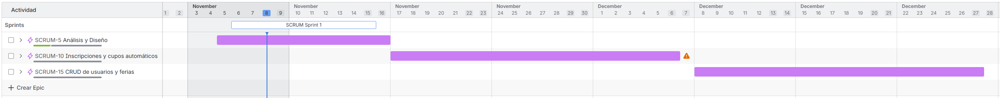
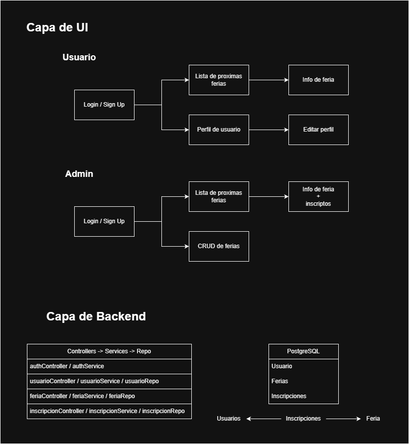
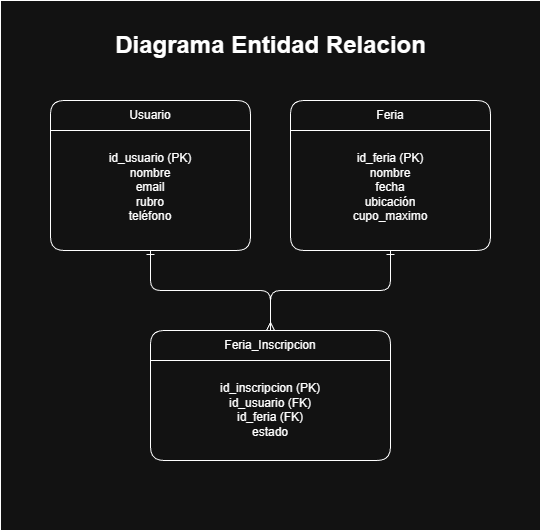

## **Acta de Constitución del Proyecto**

| **Nombre del Proyecto**                             | Sistema de inscripción a ferias.                                                                                                                                                                                                                                                                                                                                                                                                         |
| --------------------------------------------------- | ---------------------------------------------------------------------------------------------------------------------------------------------------------------------------------------------------------------------------------------------------------------------------------------------------------------------------------------------------------------------------------------------------------------------------------------- |
| **Justificación y Propósito del Proyecto**          | El propósito del proyecto es digitalizar y optimizar el proceso de inscripción, organización y comunicación de las ferias del municipio.                                                                                                                                                                                                                                                                                                 |
| **Descripción del Proyecto (de alto nivel)**        | El proyecto consiste en el desarrollo de una aplicación web que permita a los feriantes registrarse, administrar su perfil, inscribirse a ferias disponibles y gestionar listas de confirmados y espera de manera automática.  Como producto final, se obtendrá un sistema web accesible desde dispositivos móviles y computadoras, que facilite la administración municipal y la difusión de los feriantes y sus emprendimientos. |
| **Entregables Principales**                         | • Plataforma web funcional para registro y administración de feriantes.   • Sistema de inscripción a ferias con cupos automáticos y lista de espera.   • Panel de gestión para administradores municipales.   • Sección pública con información de próximas ferias.                                                                                                                                                             |
| **Exclusiones**                                     | • No tendrá un sistema de pago electrónico.   • No tendrá un módulo de mensajería interna.                                                                                                                                                                                                                                                                                                                                            |
| **Objetivos del Proyecto**                          | • Desarrollar y entregar una plataforma web funcional que permita la gestión digital de ferias del municipio.   • Plazo: completar el proyecto en un período estimado de 3 meses.   • Esfuerzo: desarrollo individual con una carga estimada máxima de 120 horas hombre.   • Otros objetivos: asegurar accesibilidad y facilidad de uso para usuarios.                                                                          |
| **Indicadores de Valor**                            | • Registrar al menos 50 feriantes dentro de los primeros 2 meses de implementación.   • Lograr que el 80% de las inscripciones a ferias se realicen mediante la plataforma sin intervención manual.   • Reducir el tiempo de confirmación de feriantes a menos de 24 horas.   • Obtener un índice de satisfacción del 85% o superior en encuestas a feriantes.                                                                  |
| **Enfoque de Gestión / Ciclo de Vida del Proyecto** | Se aplicará un ciclo iterativo e incremental con fases:   1. Análisis y Diseño   2. Desarrollo por módulos   3. Pruebas con usuarios reales   4. Ajustes y mejoras   5. Implementación y despliegue                                                                                                                                                                                                                       |
| **Hitos Principales**                               | • Aprobación del acta de constitución del proyecto.   • Finalización del relevamiento de requisitos.   • Desarrollo del Sistema de Inscripción.   • Informe de cupos automatizados.   • Despliegue en producción.   • Cierre del proyecto con reporte final de indicadores.                                                                                                                                               |
| **Principales Colaboradores**                       | • Área de Desarrollo Social.   • Área de Sistemas.   • Feriantes y Emprendedores.                                                                                                                                                                                                                                                                                                                                                  |

##### AUTORIZACIÓN DEL ACTA

| **Nombre** | **Función** | **Fecha** | **Firma** |
| ---------- | ----------- | --------- | --------- |
| ----       | ----        | ----      | ----      |

## Planificacion (primeras 8 semanas):

#### Diagrama de Grantt

#### Desglose de tareas

#### Requerimientos funcionales

| Código   | Requisito Funcional                                                                                                                 |
| -------- | ----------------------------------------------------------------------------------------------------------------------------------- |
| **RF1**  | El sistema deberá permitir el registro de feriantes mediante formulario con validación de datos personales y del emprendimiento.    |
| **RF2**  | El sistema deberá permitir a los feriantes iniciar sesión y administrar su perfil (datos personales, rubro, redes sociales, fotos). |
| **RF3**  | El sistema deberá mostrar el listado de ferias disponibles, indicando fecha, ubicación y cupo disponible.                           |
| **RF4**  | El sistema deberá permitir que los feriantes se inscriban a una feria.                                                              |
| **RF5**  | El sistema deberá gestionar los cupos automáticamente: si el cupo está completo, deberá agregar al feriante a lista de espera.      |
| **RF6**  | El sistema deberá permitir a los administradores aprobar, rechazar o remover participantes de una feria.                            |
| **RF7**  | El sistema deberá notificar al feriante cuando cambie su estado en la inscripción.                                                  |
| **RF8**  | El sistema deberá permitir a los administradores crear, modificar o cancelar ferias.                                                |
| **RF9**  | El sistema deberá generar reportes de inscriptos, cupos asignados y lista de espera por feria.                                      |
| **RF10** | El sistema deberá ofrecer una sección pública que muestre próximas ferias y feriantes confirmados para difusión.                    |

#### Requerimientos No funcionales

| Código                    | Requisito No Funcional                                                                                                                           |
| ------------------------- | ------------------------------------------------------------------------------------------------------------------------------------------------ |
| **RNF1 – Usabilidad**     | La plataforma deberá ser intuitiva y accesible para usuarios.                                                                                    |
| **RNF2 – Rendimiento**    | El sistema deberá responder en menos de 3 segundos para las operaciones principales bajo una carga de hasta 100 usuarios concurrentes.           |
| **RNF3 – Seguridad**      | Los datos personales deberán almacenarse de forma segura, con contraseñas encriptadas. Solo los administradores podrán gestionar ferias y cupos. |
| **RNF4 – Disponibilidad** | La plataforma deberá estar disponible al menos el 98% del tiempo durante el primer año de uso.                                                   |
| **RNF5 – Compatibilidad** | La plataforma deberá ser accesible desde dispositivos móviles y navegadores web modernos (Chrome, Firefox, Edge).                                |

#### Tecnologias a utilizar

| Frontend          | Next.js    |
| ----------------- | ---------- |
| **Backend**       | Express.js |
| **ORM**           | TypeORM    |
| **Base de datos** | PostgreSQL |
| **Auth**          | JWT        |

#### Arquitectura

##### Capas

**Nota**: el admin tambien puede editar la lista de inscriptos y asignarle a un usuario el estado que considere apropiado.

##### Diagrama Entidad Ralacion

**Posibles estados de la inscripcion**: iniciada, aprobada, en_espera, cancelada.
